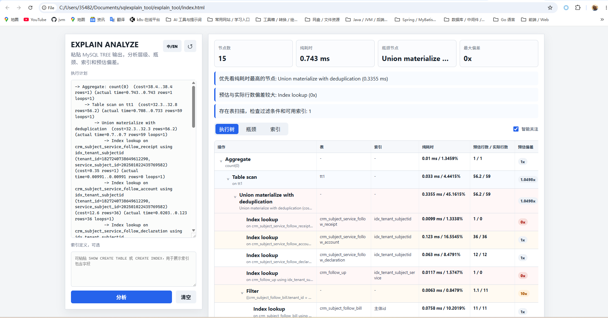

# EXPLAIN ANALYZE 可视化工具

一个零依赖的本地网页小工具，用来把 MySQL `EXPLAIN ANALYZE` 的 TREE 输出转成直观视图。

## 使用

方式一：直接用浏览器打开 `index.html`，粘贴执行计划后点击“解析”。

方式二：在当前目录运行：

```bash
node server.js
```

然后打开 `http://127.0.0.1:8765`。

可选：把 `SHOW CREATE TABLE` 或 `CREATE INDEX` 的内容粘贴到“索引定义”输入框，工具会把执行计划中的索引名映射到索引字段列表。

## 能展示什么

- 类似数据库管理工具的树形表格，左侧展开层级，右侧按列分析
- 自动高亮性能瓶颈
- 每个节点的纯耗时和纯耗时占比
- 累计耗时默认隐藏在详情中，避免误判父节点
- 智能关注度评分，低风险节点默认折叠
- 预估行数 / 实际行数、纯耗时 / 占比使用横向对比展示
- 表名、操作类型、使用索引
- 估算行数、实际行数、loops
- 过滤条件和索引条件
- 热点节点排序
- 索引使用汇总，包含从执行计划推断出的匹配字段
- 缺少 `actual time` 或无法计算耗时的节点会显示为 `-`
- 中英文界面切换

## 说明

`EXPLAIN ANALYZE` 输出通常只包含索引名和本次访问条件，不一定包含完整索引字段。要展示完整字段，请额外粘贴建表语句或索引定义。

“纯耗时”按 `当前节点耗时 - 子节点耗时之和` 估算，用来突出节点自身消耗；“累计耗时”仍保留在详情中。关注度会综合纯耗时占比、累计耗时占比、表扫描、行数预估偏差、实际行数和 loops。

